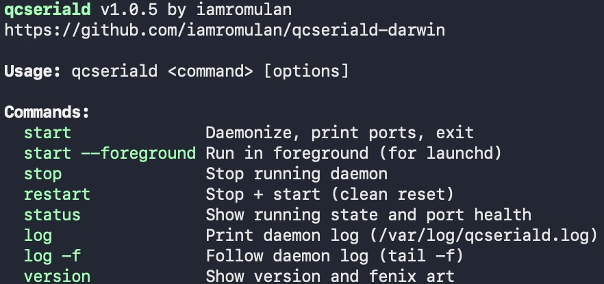

# qcseriald-darwin

<p align="center">
  
</p>

**A user-space USB serial "driver" for Qualcomm modems on macOS**

Creates virtual serial ports (`/dev/tty.qcserial-*`) for Qualcomm-based cellular modems — no kernel extensions, no DriverKit, no entitlements, no code signing required. This is the macOS equivalent of Linux's `qcserial.ko` / `option.ko`.

By [iamromulan](https://github.com/iamromulan) | Part of the [qfenix](https://github.com/iamromulan/qfenix) ecosystem

## Features

- **Automatic port identification** — DIAG, AT, NMEA, and GPS ports detected and named automatically
- **Auto-reconnect** — modem unplug/replug handled seamlessly with ~7s disconnect detection
- **EDL mode awareness** — detects when modem enters EDL (Emergency Download) mode and reports it in status without blocking [qfenix](https://github.com/iamromulan/qfenix) libusb access
- **Stale instance cleanup** — kills zombie processes from previous sessions on start (prevents exclusive access lock-ups)
- **Root enforcement** — clear error messages when not run as root
- **ADB coexistence** — does not take device-level USB access, so ADB works simultaneously
- **SIP compatible** — falls back to `~/dev/` symlinks when `/dev/` is restricted

## Supported Devices

Any Qualcomm-based USB modem using vendor-specific (class 0xFF) bulk serial interfaces. Supports 13 vendors out of the box (sourced from the [qfenix](https://github.com/iamromulan/qfenix) USB ID database):

| VID | Vendor |
|------|--------|
| 0x2c7c | Quectel |
| 0x05c6 | Qualcomm |
| 0x3c93 | Foxconn |
| 0x3763 | Sierra (alternate) |
| 0x1199 | Sierra Wireless |
| 0x19d2 | ZTE |
| 0x12d1 | Huawei |
| 0x413c | Dell (Telit/Foxconn OEM) |
| 0x1bc7 | Telit |
| 0x1e0e | Simcom |
| 0x0846 | Netgear |
| 0x2cb7 | Fibocom |
| 0x2dee | MeiG Smart |

Tested with **Quectel RM551E-GL** (VID 0x2c7c, PID 0x0122). Additional vendors can be added to the `supported_vendors[]` table in the source.

## Created Ports

| Port | Function |
|------|----------|
| `/dev/tty.qcserial-diag` | Qualcomm DIAG (detected via USB descriptor or VID/PID table) |
| `/dev/tty.qcserial-nmea` | NMEA GPS output (auto-detected) |
| `/dev/tty.qcserial-at0` | AT command port (auto-detected via AT probe) |
| `/dev/tty.qcserial-at1` | AT command port (auto-detected via AT probe) |

ADB interfaces are automatically skipped and left available for `adb` to use directly.

## Requirements

- macOS 13+ (Ventura or later, tested on macOS 26 Tahoe)
- Xcode Command Line Tools (`xcode-select --install`)
- Root access (sudo) for USB device access and `/dev` symlinks

No third-party dependencies.

## Build

```bash
make
```

## Usage

```bash
# Start as daemon (prints ports, returns to shell)
sudo ./qcseriald start

# Start in foreground (for debugging or launchd)
sudo ./qcseriald start --foreground

# Check status and port health
sudo ./qcseriald status

# Restart (stop + start)
sudo ./qcseriald restart

# Stop the daemon
sudo ./qcseriald stop

# View daemon log
sudo ./qcseriald log

# Follow daemon log in real-time
sudo ./qcseriald log -f

# Show version and fenix art
./qcseriald version
```

Then in another terminal:
```bash
screen /dev/tty.qcserial-at0 115200
# Type: AT
# Response: OK
```

## How It Works

```
USB Modem (bulk endpoints)
    |  IOKit user-space USB API
qcseriald daemon (runs as root)
    |  openpty() + bridge threads
/dev/tty.qcserial-{diag,nmea,at0,at1}
    |
Any serial tool (screen, minicom, picocom, qfenix, etc.)
```

1. Enumerates all `IOUSBHostDevice` entries via IOKit
2. Finds the modem by matching vendor ID against the supported vendors table
3. Skips EDL-mode devices (Sahara/Firehose protocol, not serial)
4. Waits 2s for USB pipe endpoints to stabilize after device discovery
5. Opens each vendor-specific (class 0xFF) interface via registry-based discovery
6. Creates a pseudo-TTY pair per interface using `openpty()`
7. Symlinks each PTY slave to a friendly `/dev/tty.qcserial-*` name
8. Probes unknown ports (AT command + RDY URC) for automatic identification
9. Bridges data between USB bulk endpoints and PTY masters via dedicated threads
10. Monitors bridge health and auto-reconnects on modem disconnect/reconnect

Single C file, no third-party dependencies. Links against IOKit, CoreFoundation, and libutil.

### Port Auto-Detection

On startup and reconnect, ports start with `-loading` suffix while the daemon identifies them:

1. **DIAG** — identified immediately by USB descriptor (subclass 0xFF, protocol 0x30) or VID/PID lookup table (~50 device models)
2. **AT ports** — detected by sending `AT\r` and checking for `OK`/`ERROR` response (~3 seconds)
3. **NMEA/GPS** — inferred as the remaining port after AT ports are identified

If the modem isn't ready yet (fresh boot), the daemon waits for the `RDY` URC before probing.

### Auto-Reconnect

When the modem is unplugged, reboots, or switches modes (e.g., EDL), the daemon detects disconnection within ~7 seconds and enters a rescan loop. When the modem comes back, ports are automatically recreated and re-identified — no manual restart needed.

### EDL Mode Detection

When a modem enters EDL (Emergency Download) mode — for example via `qfenix diag2edl` — the daemon recognizes the EDL VID/PID and reports it in status output:

```
  EDL device detected: Qualcomm CDMA Technologies MSM (libusb port — not bridged)
```

The daemon does not attempt to bridge EDL devices, leaving them available for [qfenix](https://github.com/iamromulan/qfenix) to access via libusb for firmware flashing operations.

### Stale Instance Cleanup

If the daemon is killed uncleanly (`kill -9`), or leftover processes exist from previous sessions, running `sudo qcseriald start` will automatically find and kill all stale `qcseriald` processes before starting fresh. This prevents IOKit exclusive access lock-ups that would otherwise require a physical USB replug.

### ADB Coexistence

The daemon does not take device-level USB access, so ADB works simultaneously. It also automatically sets `ADB_LIBUSB=0` system-wide to work around an ADB bug with non-contiguous USB interface numbers.

## Install (system-wide)

```bash
sudo make install
```

This installs the binary to `/usr/local/bin/` and a launchd plist for optional auto-start:
```bash
# Enable auto-start at boot
sudo launchctl load /Library/LaunchDaemons/com.iamromulan.qcseriald.plist

# Start manually via launchd
sudo launchctl start com.iamromulan.qcseriald

# Disable auto-start
sudo launchctl unload /Library/LaunchDaemons/com.iamromulan.qcseriald.plist
```

## Uninstall

```bash
sudo make uninstall
```

## Known Issues

### SIP (System Integrity Protection) and `/dev/` Symlinks

The daemon creates friendly symlinks like `/dev/tty.qcserial-at0` pointing to the real PTY device (e.g., `/dev/ttys042`). On macOS with SIP enabled (the default), `/dev/` is a `devfs` mount with increasing restrictions in newer macOS versions.

The daemon handles this automatically with a fallback strategy:

1. **Try `/dev/` first** — On startup, a test symlink is created in `/dev/`. If it succeeds, all port symlinks use `/dev/` as usual.
2. **Fall back to `~/dev/`** — If `/dev/` symlinks are blocked by SIP, the daemon creates symlinks in the real user's home directory under `~/dev/` (e.g., `/Users/you/dev/tty.qcserial-at0`). This directory is auto-created if needed and owned by the real user (resolved from `SUDO_USER`).

Check `sudo qcseriald log` to see which directory was selected — the log will show either `Symlink directory: /dev (native)` or `Symlink directory: /Users/you/dev (fallback)`.

If using the `~/dev/` fallback, point serial tools at the full path:
```bash
screen ~/dev/tty.qcserial-at0 115200
```

### `launchctl setenv` Restrictions

The daemon runs `launchctl setenv ADB_LIBUSB 0` at startup to work around an ADB bug with non-contiguous USB interface numbers. On macOS 14+ with SIP enabled, `launchctl` environment manipulation may be restricted. If this fails, ADB (not the daemon) may have issues connecting to the modem. This only matters if you use ADB alongside the serial bridge.

**Workaround:** Set the variable manually in your shell profile:
```bash
echo 'export ADB_LIBUSB=0' >> ~/.zshrc
```

### Gatekeeper Quarantine

If you download a pre-built binary from GitHub, macOS will quarantine it and Gatekeeper will block execution. Fix by removing the quarantine flag or building from source:

```bash
# Remove quarantine from downloaded binary
xattr -d com.apple.quarantine qcseriald

# Or just build from source (recommended)
make
```

## Disabling SIP

> **Warning:** Disabling SIP reduces macOS system security. Only do this if you understand the implications and need full `/dev/` symlink support or are troubleshooting daemon issues. For most users, the daemon works fine with SIP enabled.

SIP can only be disabled from macOS Recovery Mode:

### Intel Macs

1. Restart your Mac and hold **Command + R** during boot until the Apple logo appears
2. Once in Recovery Mode, open **Utilities > Terminal** from the menu bar
3. Run:
   ```bash
   csrutil disable
   ```
4. Restart your Mac

### Apple Silicon Macs (M1/M2/M3/M4)

1. Shut down your Mac completely
2. Press and hold the **power button** until you see "Loading startup options..."
3. Click **Options**, then click **Continue**
4. If prompted, select a user and enter their password
5. From the menu bar, open **Utilities > Terminal**
6. Run:
   ```bash
   csrutil disable
   ```
7. When prompted, enter your admin password and confirm
8. Restart your Mac

### Verify SIP Status

```bash
csrutil status
# "System Integrity Protection status: enabled." = SIP is on (default)
# "System Integrity Protection status: disabled." = SIP is off
```

### Re-enabling SIP

Follow the same steps above but run `csrutil enable` instead. It is recommended to re-enable SIP when you no longer need it disabled.

## License

MIT License. See [LICENSE](LICENSE).
